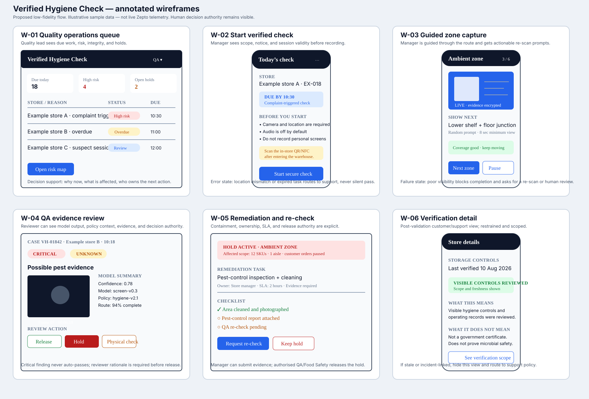

# Stage 03 — Verified Hygiene Check Wireframes

**Status:** Proposed low-fidelity design; not a production UI or Figma file
**Purpose:** Make the key user, review, and exception states tangible enough to test before engineering investment
**Related PRD:** [PRD and technical contract](../stage-04-product-delivery/40_prd_and_delivery.md)

## Design principles

- Show the next action, not only the system status.
- Make evidence provenance visible to reviewers without exposing unnecessary worker data.
- Treat `unknown`, incomplete, and suspicious sessions as explicit states; never silently convert them into pass.
- Keep manager capture focused on route completion and corrective guidance.
- Keep hold/release authority with the authorised human role.
- Use plain language, accessible contrast, large touch targets, and no colour-only status cues.

## Wireframes

## Screen map

| Screen | Primary user | Product question answered | Key state covered |
|---|---|---|---|
| W-01 Quality operations queue | Quality lead | Which stores need attention now, and why? | Overdue, high-risk, integrity exception, open hold |
| W-02 Start verified check | Store manager | What am I recording, why, and is this session valid? | Permission denied, location mismatch, challenge failure |
| W-03 Guided zone capture | Store manager | What must I show next, and is the evidence sufficient? | Route progress, random prompt, poor quality, offline upload |
| W-04 QA evidence review | QA / Food Safety reviewer | What did the model see, what policy applies, and what should happen? | Critical finding, `unknown`, disagreement, physical-check request |
| W-05 Remediation and re-check | Manager / QA | Who owns the corrective action, what is held, and what closes it? | SLA breach, partial fix, re-check, release approval |
| W-06 Verification detail | Support / customer, post-validation only | What was checked, when, and what does it not prove? | Stale verification, limited scope, incident-linked restriction |

## Interaction and accessibility notes

- W-02 must explain camera, location, and worker notice requirements before capture begins.
- W-03 must allow pause/resume only when the integrity policy permits it; otherwise it creates a reviewable interruption event.
- W-04 must provide evidence frames, timestamps, model/policy version, and reviewer rationale together.
- W-05 must show hold scope and release authority before a manager can mark remediation complete.
- W-06 must never use “safe,” “certified,” or “AI-approved” language; it should show verification scope and freshness.
- Every critical state needs a text label, icon, and action—not colour alone.
- Text, prompts, and remediation guidance should support Hindi and other operating-region languages after the baseline language is approved.

## Traceability

| Wireframe requirement | PRD requirement | Validation evidence |
|---|---|---|
| Task queue and due state | VHC-01 Risk-based tasking | Due-check SLA and risk-trigger logs |
| Session validity | VHC-02 Secure capture, VHC-03 Store verification | Invalid-session test report |
| Route progress and quality | VHC-04 Guided coverage | Route completeness and manager-time metrics |
| Evidence-based review | VHC-05 Explainable findings, VHC-06 Safe decisioning | Category recall, false-pass, unknown, and disagreement reports |
| Corrective action | VHC-07 Remediation | Critical remediation closure and re-check export |
| Provenance and privacy | VHC-08 Audit trail, VHC-09 Privacy | Access log, retention/deletion audit, decision history |
| Independent challenge | VHC-10 Independent challenge | Virtual/physical disagreement and calibration report |
