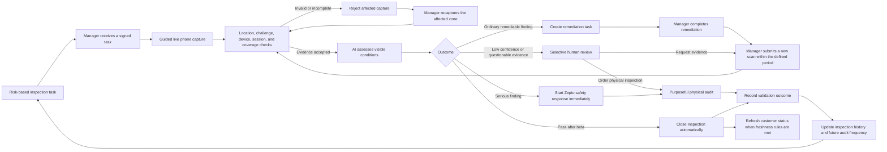
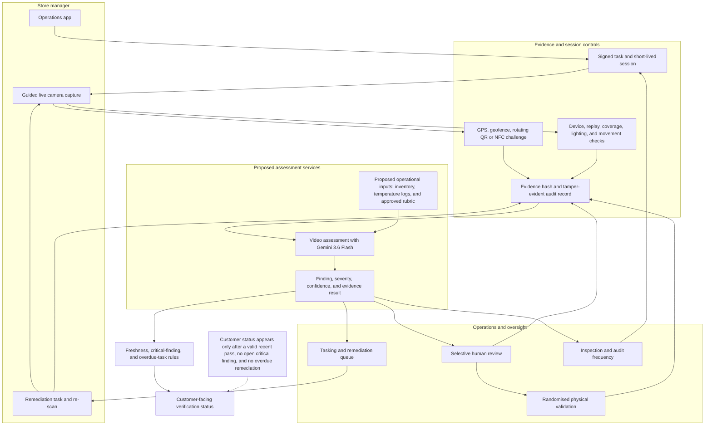

# AI-assisted store audit flow

These diagrams describe the proposed Verified Hygiene Check workflow. They separate the normal operating path from the supporting system view.

The workflow is proposed. Zepto's internal systems, policies, staffing model, and data integrations require confirmation during discovery.

## 1. Operating workflow

### Decision rules

- **Store risk** changes future inspection or audit frequency. It does not fail an otherwise acceptable scan.
- **Finding severity** determines whether the outcome is a pass, remediation task, immediate safety response, or review.
- **Model confidence** is calibrated during beta by finding category. It determines whether automation is allowed for that category.
- **Evidence integrity** determines whether the capture is accepted, rejected for recapture, or sent to review.
- One failed remediation retry triggers human review. Serious findings follow the relevant Zepto safety process immediately.
- Normal successful scans can close automatically after the beta thresholds are met. Human review remains selective.

## 2. Proposed system view

The video service evaluates visible conditions. Operational inputs supply information that a recording cannot establish, such as digital expiry data or temperature history. The proposed integrations must be confirmed with Zepto.

## 3. What each system boundary protects

| Boundary | Purpose | Example output |
|---|---|---|
| Capture app | Guides the route and prevents gallery uploads | Required zones completed |
| Evidence controls | Checks store presence, session validity, and capture integrity | Accepted, recapture, or review |
| AI assessment | Interprets the accepted evidence | Finding category, severity, confidence, evidence frame |
| Operational data | Supplies information outside the video | Inventory or temperature record for review |
| Remediation workflow | Assigns and verifies corrective action | Owner, due time, evidence, re-check |
| Human review | Handles serious, uncertain, or questionable cases | Decision, evidence request, or physical audit |
| Physical validation | Estimates remote false passes and challenges the system | Audit result and calibration label |
| Customer status | Shows a limited, current verification statement | Last verified date and scope |

## 4. Beta and steady-state behaviour

During beta, a human independently assesses the same submitted evidence without seeing the AI result. Randomised physical checks include cases where the AI and reviewer agree. This separates evidence-only agreement from validation against actual store conditions.

After category-level safety and operating thresholds are met, routine successful inspections can close automatically. Human review remains available for serious findings, low confidence, questionable evidence, failed remediation retries, and layout changes that require verification.
